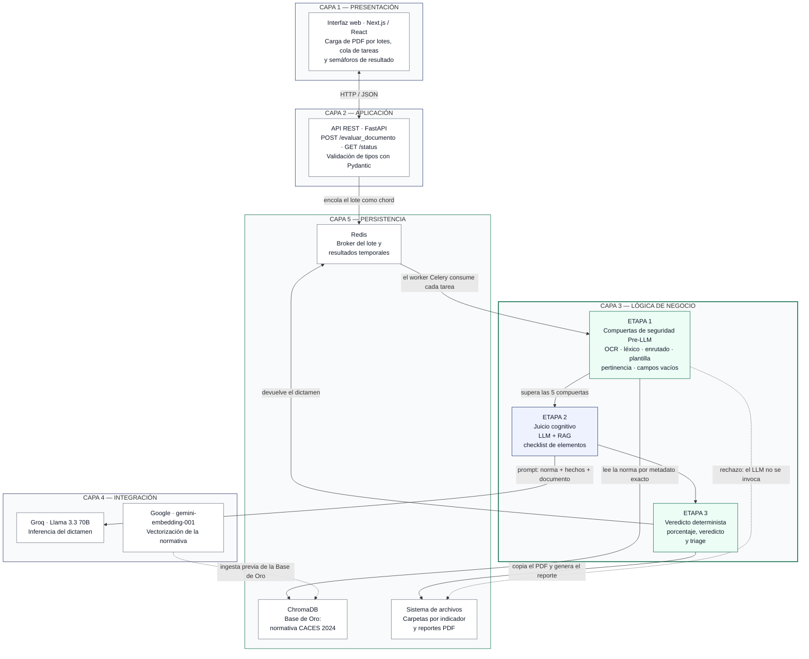
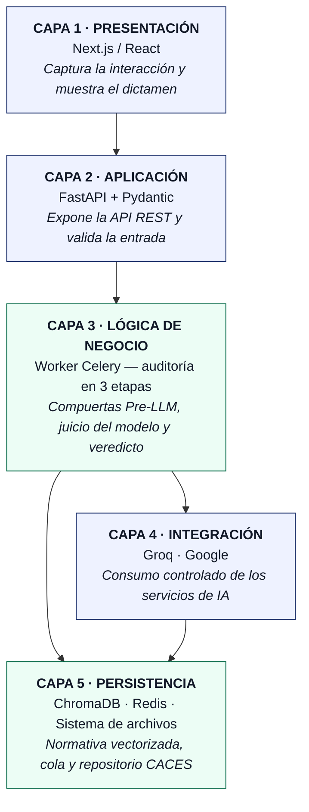
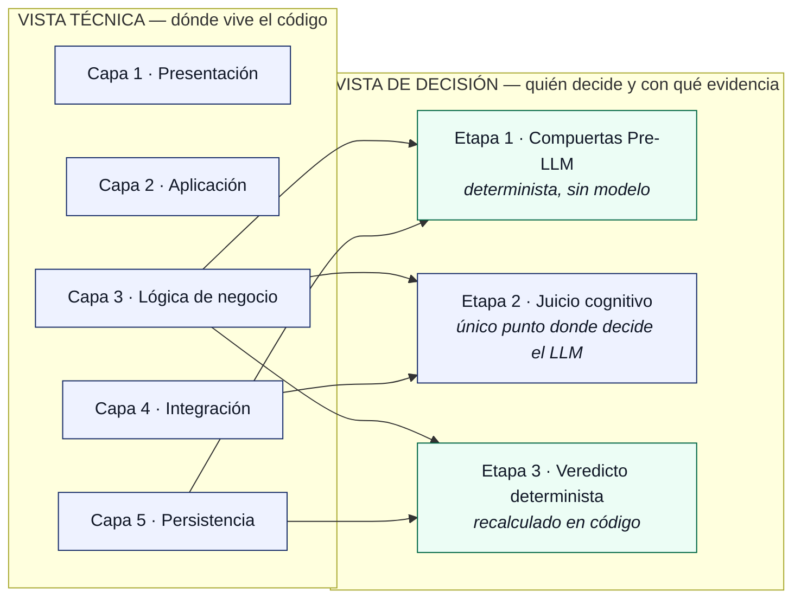

# Arquitectura en capas — diagramas Mermaid

Diagramas de la **vista técnica N-capas** del Auditor IA CACES, en Mermaid.

Dos avisos antes de usarlos:

- **Vocabulario.** "Capa" se reserva para la vista técnica (las cinco de aquí). El pipeline de
  decisión se llama **auditoría en 3 etapas**, y su filtro determinista, **compuertas de
  seguridad Pre-LLM**. Es el mismo criterio que sigue la presentación de defensa.
- **OCR, no pdfminer.** Los diagramas describen la versión que documenta el manuscrito.

Para exportarlos: pegar el bloque en <https://mermaid.live> y descargar en PNG o SVG. En SVG
entran en PowerPoint como vector y se ven nítidos al proyectar.

---

## 1. Diagrama completo — capas y flujo de una auditoría

Es el que sirve para explicar la arquitectura de verdad: muestra las cinco capas **y** por dónde
circula un documento.

**Lo que hay que saber leerle:** la flecha punteada de la ETAPA 1 al sistema de archivos es el
aporte defendible de la arquitectura. Un documento que no supera las compuertas se archiva y se
reporta **sin llegar nunca a la capa 4**: el modelo no se invoca, no gasta cuota y no puede
alucinar sobre un documento que no leyó.

---

## 2. Variante compacta — sólo la pila de capas

Para una diapositiva donde sólo hace falta enseñar el apilamiento y quién depende de quién.

Nota: la capa 3 apunta a la 4 **y** a la 5 porque el worker consulta los servicios de IA y
persiste el resultado; no es una pila estrictamente lineal.

---

## 3. Correspondencia entre las dos vistas

Responde a la pregunta que el tribunal hará si ve "5 capas" en un sitio y "3 etapas" en otro.

No son dos arquitecturas: son dos cortes del mismo sistema. El de la izquierda responde *dónde
vive el código*; el de la derecha, *quién toma cada decisión y con qué evidencia*.
